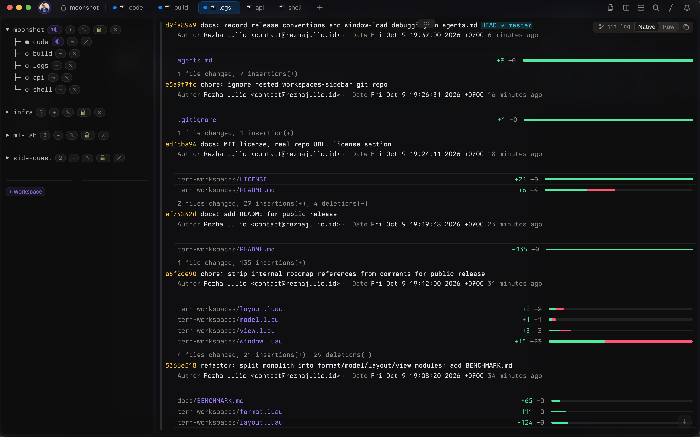

# workspaces-sidebar

A pinned workspaces sidebar for [Tern](https://stencil.so/tern), Stencil's Rust-native neoterminal. Every session is a workspace, every tab is a row in a tree, and everything that needs your attention has a badge.

If you keep several agents and long-running commands going across sessions, you know the problem. You can't see which tab is waiting on you without cycling through all of them. This plugin fixes that.



## What you get

A native canvas pane on the left of every tab. It lists your sessions as workspaces, with each session's tabs nested underneath. Each tab shows a live status badge:

| Badge | Meaning |
| --- | --- |
| ? | An agent is waiting for input |
| ◐ | A command is running |
| ! | A command failed |
| ◆ | An agent block |

Workspace headers show aggregate counts of the same badges, so you can see that something in a folded workspace needs you without opening it.

## Why sessions are workspaces

In Tern, a session is a named, persistent collection of tabs. The daemon keeps it alive when you close the window and across reboots. That is already what most people mean by "workspace", so the plugin doesn't invent a new concept. It reads your sessions and draws them as a tree. Nothing to configure, nothing to migrate.

## Features

### Navigation

Click a workspace name to switch to it. Click any tab to jump straight there. This works across workspaces, in one click, with no switch-then-pick step.

Workspaces also have keyboard jumps (Cmd+Alt+1 to 9). `Workspaces: next needing attention` (Cmd+Alt+Shift+A) goes to the first tab with a waiting agent, an alert or a failed command. If nothing needs you, it toasts "All tasks clear". I use this one more than any other binding.

The status line shows the current workspace name. Click it to toggle the sidebar.

### Keeping it tidy

Each workspace folds with its chevron. A collapsed workspace shows its tab count.

Tabs can carry color tags. Click the color badge to cycle through Tern's native tab colors: blue, green, yellow, orange, red, purple, teal, pink. Tags persist across restarts.

To move a tab to another workspace, click its ⇥ badge. Every other badge hides, and you pick "Move here" on the target. Esc cancels. To reorder inside a workspace, shift-click a tab row to move it up, or alt-click to move it down.

### Creating and closing

The `+` on a workspace header opens a new tab in that workspace's directory. `+ Workspace` at the bottom creates a session named after your current folder and opens it there. If the name is taken, it dedups.

`✕` closes a tab. Closing a whole workspace is guarded: lock it with the 🔒/🔓 toggle and it can't be closed by accident.

Press Ctrl+D in a shell and the tab closes cleanly. Without this, you get an orphaned sidebar sitting alone in a dead tab. You can turn it off.

### Layout and focus

The sidebar mounts itself on every tab. Drag the divider once and every tab follows. The plugin calibrates against window width automatically.

Focus behaves. Clicking around the sidebar never leaves focus stranded on it, and switching tabs restores the terminal focus of the tab you're going to.

Paths come in two styles. Smart shows the folder basename, or parent/basename for generic directories like `src`. Fish style shows `~/W/p/tern-sidebar`. Color tag labels can be shown or hidden.

## Install

You need Tern (closed beta). From a git URL:

```sh
tern plugin install github.com/rezhajulio/workspaces-sidebar
```

Or from a local checkout:

```sh
tern plugin link .
tern plugin reload
```

## Commands and keybindings

| Action | Binding |
| --- | --- |
| Workspaces: next needing attention | Cmd+Alt+Shift+A |
| Jump to workspace 1 to 9 | Cmd+Alt+1 to 9 |
| Toggle sidebar | Click the status line segment |
| Cancel move mode | Esc |

Mouse actions:

| Action | Gesture |
| --- | --- |
| Switch workspace | Click its name |
| Jump to tab | Click the row |
| Fold or unfold workspace | Click the chevron |
| New tab in workspace directory | `+` on the header |
| New workspace from current folder | `+ Workspace` at the bottom |
| Close tab | `✕` |
| Lock or unlock workspace | 🔒/🔓 |
| Cycle tab color | Click the color badge |
| Move tab to another workspace | ⇥ badge, then "Move here" |
| Move tab up or down | Shift-click or alt-click the row |

## Toggles

| Toggle | Options |
| --- | --- |
| Tab color tags | On or off |
| Color tag labels | Shown or hidden |
| Path display | Smart or fish style |
| Close tab on Ctrl+D | On or off |

## How it works, and what it can't do

Tern's Luau API has no window-level sidebar. So the plugin mounts one pane per tab, automatically, and keeps their widths in sync. It looks like one sidebar. Under the hood it is many.

Some things are stashed until Tern exposes the APIs they need: session notes and filter chips.

Drag-and-drop reorder isn't possible, because canvas panes only receive clicks. That's why reordering uses modifier-click.

## Development

```sh
tern plugin link .
tern plugin reload
tern plugin list --json
```

Layout of the repo:

| File | Role |
| --- | --- |
| `plugin.toml` | Manifest |
| `window.luau` | Wiring |
| `format.luau` | Formatting helpers |
| `model.luau` | State |
| `layout.luau` | Layout |
| `view.luau` | Drawing |
| `tern.d.luau` | Types, regenerate with `tern plugin types .` |
| `check_test.py` | Manifest and action parser asserts |

## License

MIT. See [LICENSE](LICENSE).
